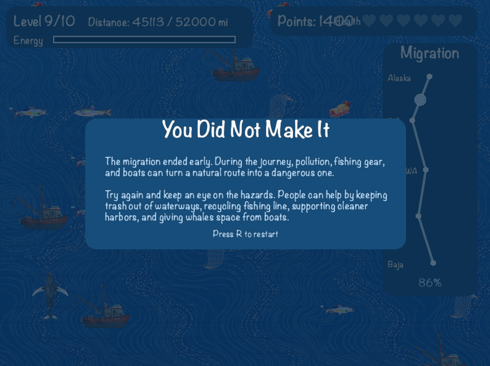
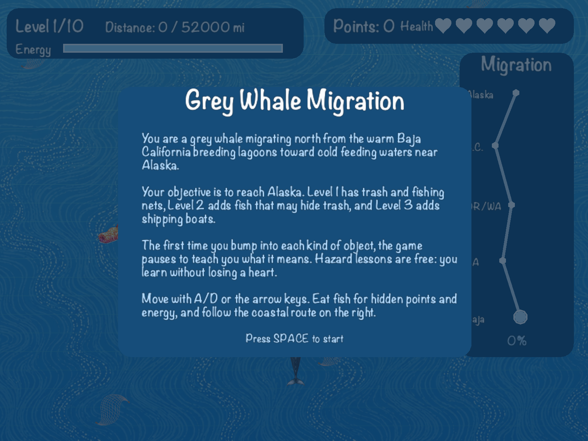
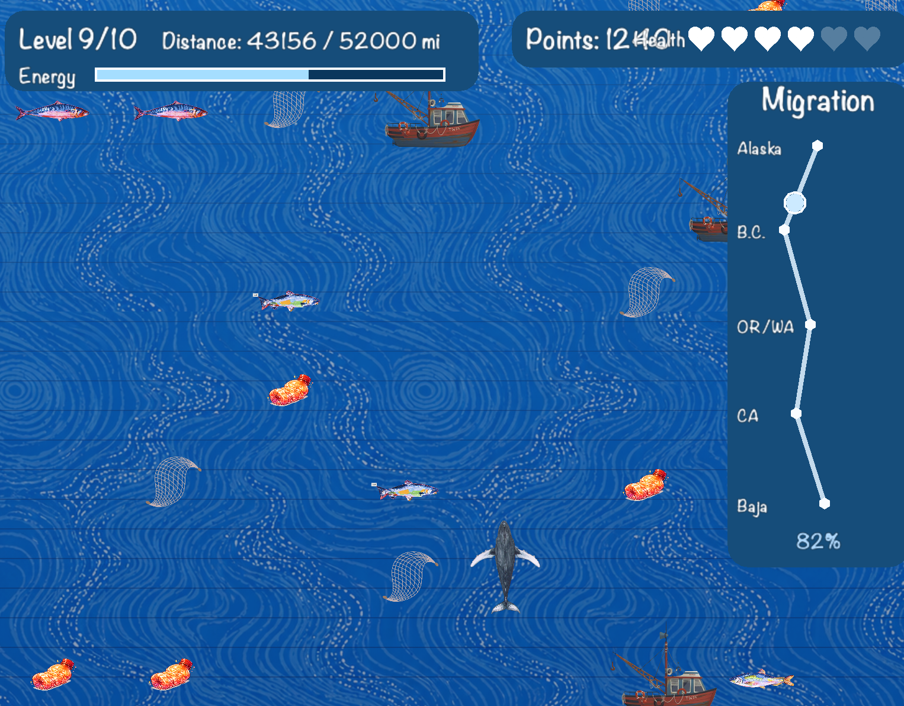

**Note:** Delete the template README.md file and rename this file to README.md before submitting.

---

# Your Game Title Here

**Group Members:** Annabelle, Fia
## Description

This is a game following the migration of a grey whale, and the player sees the hardships that the whale faces, such as pollution, fishing boat harm and limited food access. It is a perfect difficulty level as it is doable for a player to get through 2/3 of the game in the first attemps, but actually winning would take many tries so there is a good mix of instant gradification and difficulty that the player has to overcome.

## Justification

When making our game we made some edits to our origional plan to improve gameplay and flow. On of the biggest changes we made was getting rid of the fishing boat that competed with the player to capture tokens 

## Screenshots

[journey end]
[journey end]
[journey end]

## How to Install & Play

Simply download the game executable for your operating system and double-click it to play. No installation required!

Mac:
Your link here

Windows:
Your link here
